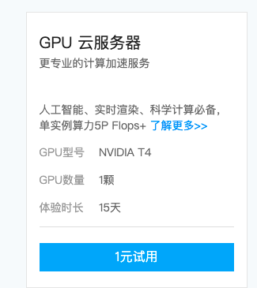
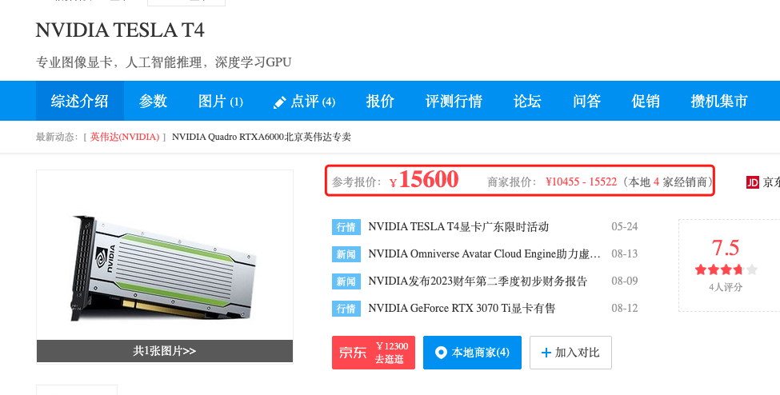
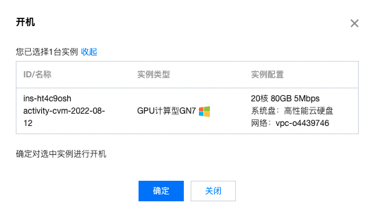
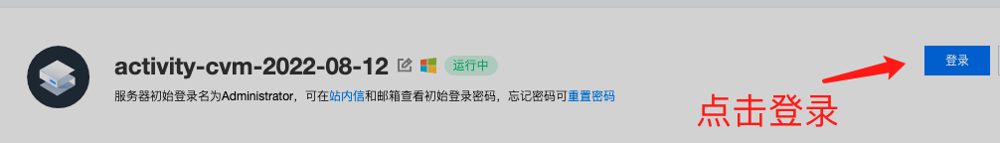
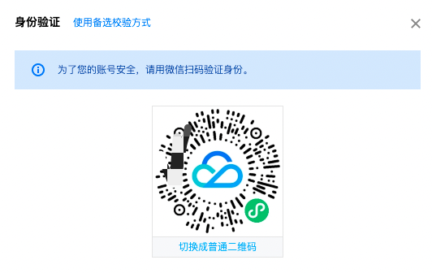
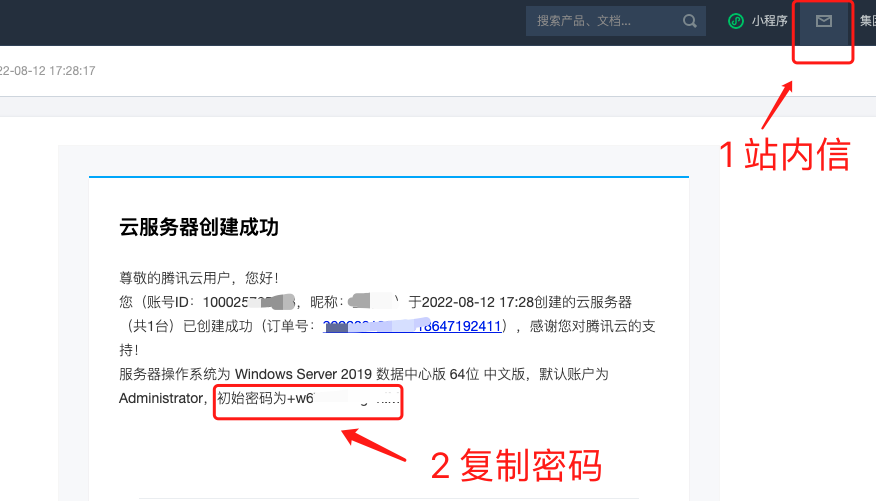
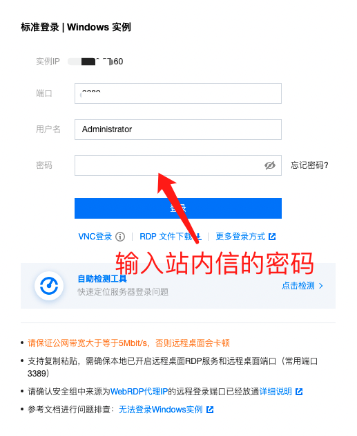
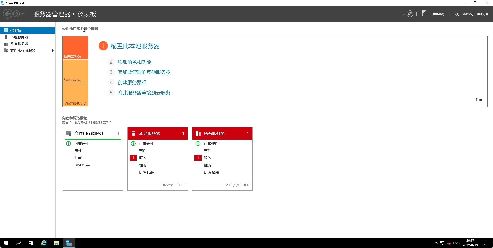

如何用腾讯云跑深度学习

# 准备好一台云服务器

这一步可以使用腾讯云提供的近乎于免费的GPU云服务器，比如这个GPU为tesla T4显卡，只需要1块钱，就可以免费体验15天。

而同样的显卡，如果自己买的话，需要1万多。

如果你已经把代码和部分数据集在自己的电脑上跑通的话，那15天可以完整的跑很多次实验了。

我用的是就是这款GPU，购买成功后就可以点开这个实例，界面就是如下。

# 开机

# 点击登录

# 二维码验证

# 获取密码并登录

输入站内信中的密码

# 简单看下云服务器

跟普通的windows系统没什么区别，当然可以重装系统为linux系统，都是可以的。

# 进入云服务器并安装必要的驱动以及软件

1. 显卡驱动
2. CUDA
3. cuDNN驱动
4. Pytorch
5. Pycharm

至于如何安装以上，我是按照这篇文章的，非常详细，强力推荐。
https://cloud.tencent.com/developer/article/2003361?from=article.detail.1979035

