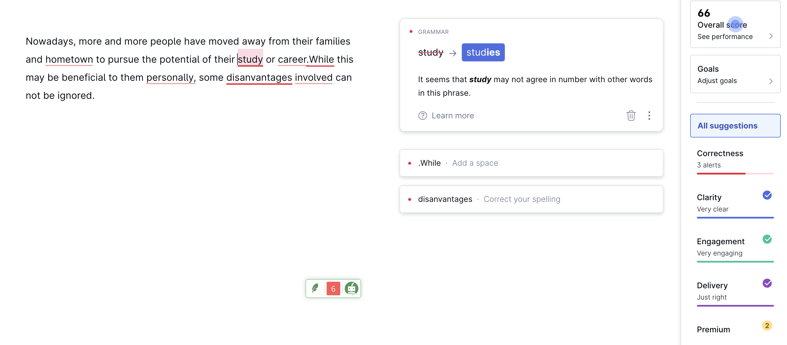
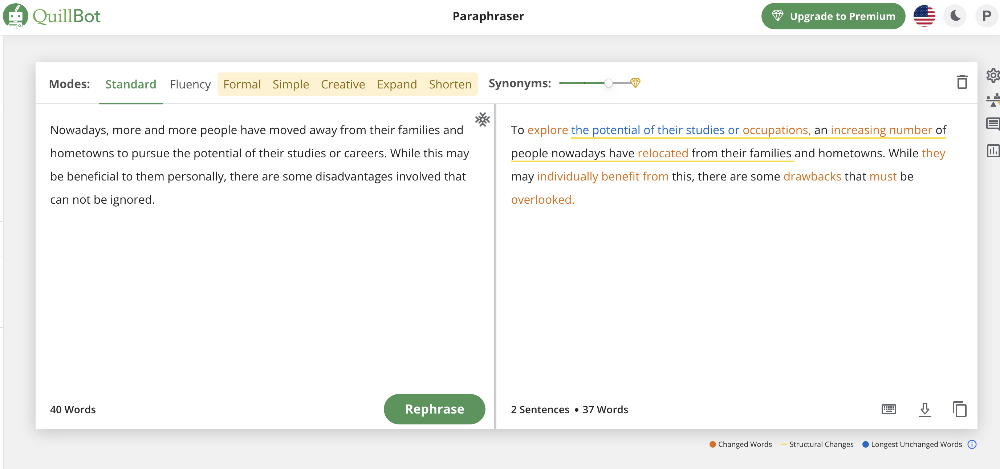
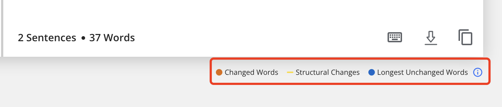
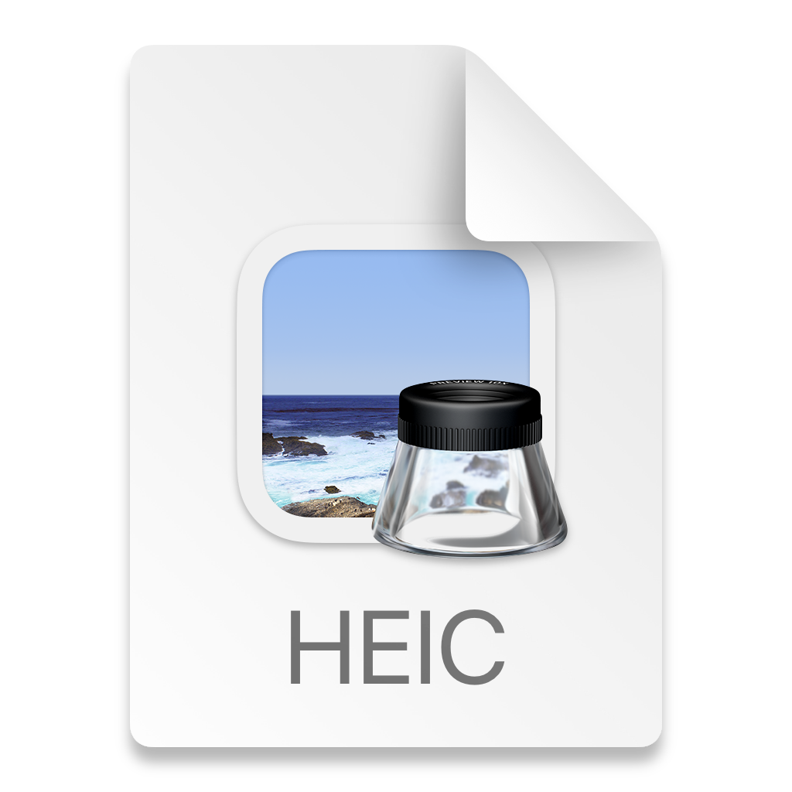
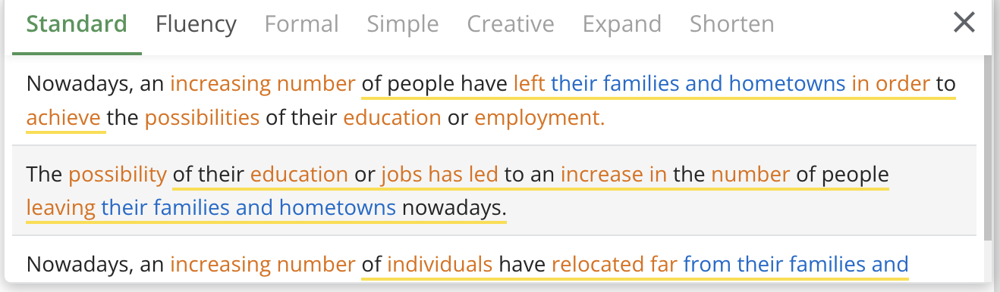

​​预告：这是一个针对于零基础英语写作的教程，里面会介绍三个网站，我称之为最强三板斧。

首先问你自己一个灵魂问题：你是到底不会英语呢，还是写作呢？

如果是前者，那好说，提升英语水平就ok了。但是后者就比较麻烦，因为中文写作都不会的话，那要补的东西就太多了。

当然了，我相信经过九年义务教育，甚至再加上高等教育的几年，大家对于中文写作虽然做不到信手拈来，但是起码写个简短的议论文问题不大。

我来给大家分享一个非常高效的英文写作技巧，就算你是零基础也没关系，绝对可以写出非常地道的英文，不仅语法错误是不存在的。同时，还可以同时帮助你学习英文写作，特别是**语法**和**词汇**。

# 写作方法论：

写作文无非就是两个部分：构思+写作。

**构思**是非常简单的，因为我们在打算英文写作的前提，肯定已经理解了中文含义了。对于中文写作，我们绝对不可能无话可说。

说白了，我们就剩下如何把中文思路转化成英语语句对吧。

也就是英文**写作**，我们最大的短板，写作真的是很难提升的一个部分， 你可以看到很多人雅思阅读8分，听力8分，结果写作才6分。

但是大多数情况下我们没有雅思写作的时间限制，所以在各种**外挂**的帮助下，写出一篇地道的英文是没什么问题的。

# 英语写作外挂

我们要做的就是将中文->自己的脑子->英语。

但是我们的脑子对于英语写作掌握程度太低，那么我们只需要将自己的脑子换成另一套**处理系统**就ok了。

那么这套系统就是「Google翻译+Grammarly改语法+Quillbot润色」。

这个组合拳打下来，不仅可以帮助你写好英文写作，同时还可以帮助你提升自己的写作水平

我们来拿个例子来验证一下：

这是2022年4月30日的一个雅思写作真题：

Nowadays, people spend more and more time away from their families. Why is this? What effect will it have on themselves and their families?

题目很简单，翻译过来就是：如今，人们越来越多地远离家人。 为什么是这样？ 会给自己和家人带来什么影响？

我们可以按开头+两个原因+两个影响+总结的方式来写。

我们先写个中文的开头：

现如今，越来越多的人离开了家庭或者家乡，以便去追求他们在学业或者事业上的可能性。虽然这样对他们个人来说可能是有好处的，但是我们不得不正视这样做的带来的负面影响。

我来试着写一段对应的英语，你也可以先把英文写出来。

Nowadays, more and more people have moved away from their families and hometown to pursue the potential of their study or career. Although there are obvious advantages for indiviuals, some disanvantages involved can not be ignored.

这是我的翻译，我并没有直接用google 翻译，因为我还是想自己写，然后再用软件纠错。

我先放到google翻译里面，去看我的英文能不能对应我中文想表达的意思。

很明显个人优势那里是错的，这时候我们就需要google翻译下我们那句中文。

这个英文表达的明显比我的好，至少表达我想要的意思。

ok，这时候我们的英文是这段，我只替换了红框里那半句。

Nowadays, more and more people have moved away from their families and hometown to pursue the potential of their study or career.While this may be beneficial to them personally, some disanvantages involved can not be ignored.

这是保证了我们的意思是没错的。

然后要用grammarly做语法检测。

可以看到红线代表了有问题的地方，比如hometown要变复数，study和career同理，然后加要补充一个there are。

现在我们的句子已经没有语法问题了，同时给自己一个记性，一定要注意单复数。

Nowadays, more and more people have moved away from their families and hometowns to pursue the potential of their studies or careers. While this may be beneficial to them personally, there are some disadvantages involved that can not be ignored.

最后一步，我们要开始润色了，同时修改一些句子结构，以便让它变得更地道。

这一步要用的就是我们的神器quillBot。

我们把句子放进去，然后点击rephrase

可以很明显的看到句子变得不一样了，但是更地道了。我们也可以微调一下。

从上图可以看到，凡是有颜色的词和句子，都是可以改的。

橙色的可以换词，蓝色的最长的没改过的词，下划线的可以改整个句子。

我们一个个举例：

1. 橙色换词

可以看到，我们最初用的是career，然后有很多可以选，比如occupations，jobs，professions等等，我们就可以通过这个记住更多的同义词。

2. 下划线改整个句子

改句子也有三种不同的方式，我个人更喜欢第三种。

好了，我们这一段话的最终版来了。

Nowadays, an increasing number of individuals have **relocated** far from their families and hometowns in order to achieve the **possibilities** of their **education** or **employment**. While they may individually benefit from this, there are some **drawbacks** that must be **overlooked**.

是不是比刚开始的好多了。

同理后面的段落也可以这样写，但我建议大家最开始还是写英文，实在不会再去直接翻译。
